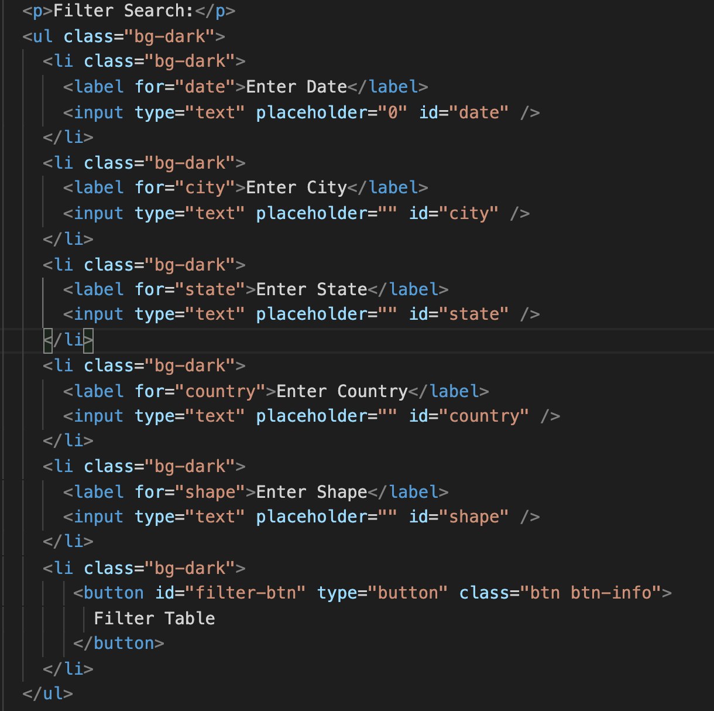
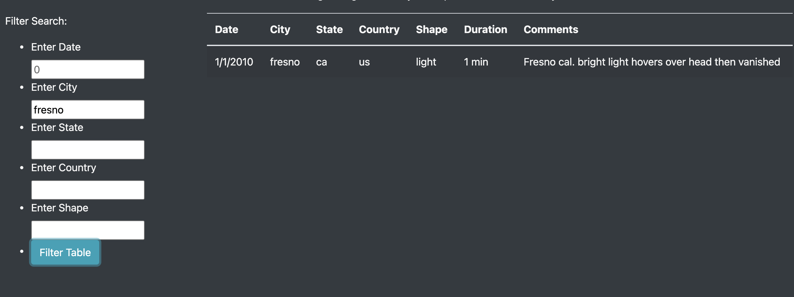
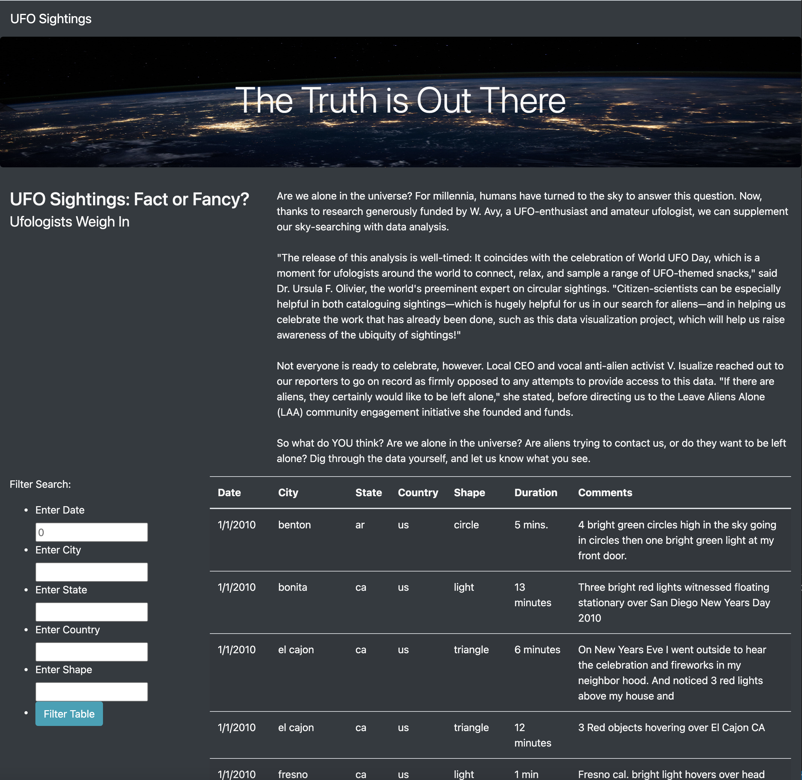

### UFO Sightings
## Overview of Project: 

The propose of the UFO sightings webpage is allow users to filter for multiple criteria such as date, the city, state, country and shape at the same time. 

## Results: 

1. Modify the code in the index.html file with filter search:

2. Create filters: date, the city, state, country and shape in the app.js file

Please see below city filter example: 

## Summary: 

As a result, we have the webpage with filters of the UFO data. You can search by date, the city, state, country and shape at the same time.

However, a drawback of this new design is that you cannot export the filtered data in excel of PDF file. I would recomend to add a new button "download as an excel of PDF" the search result. My second recommendation is to add pictures of shapes of UFO Sightings.

